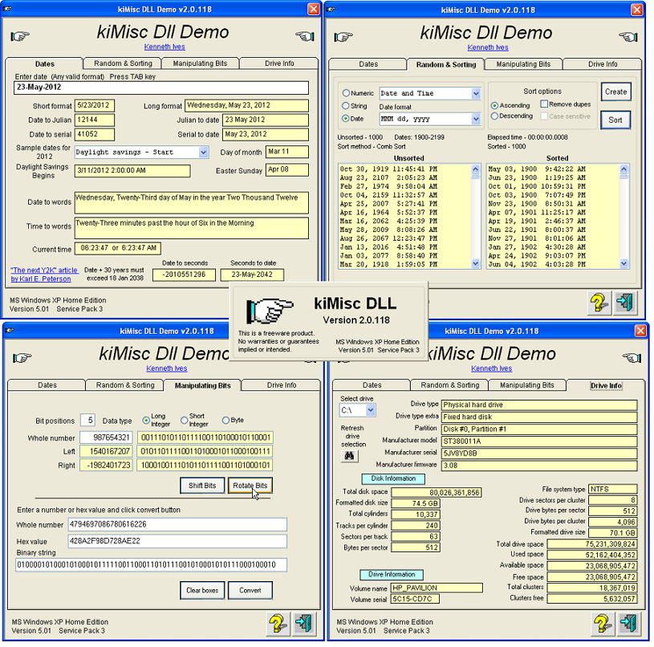



## Misc functions  01\-Jul\-2012

### Description

Miscellaneous class functions wrapped into a single DLL. These are some of the most common that I use for creating applications. Well documented. If you find any problems, please email me.

=== 15-Jun-2012 Updated clsSort.cls and clsConvertDateTime.cls modules.

=== 01-Jul-2012 Updated conversion routines to handle negative values in cls64BitMath.cls.
 
### More Info
 

             |
---                |---
**Submitted On**   |2012-06-30 17:16:54
**By**             |[Kenaso](https://github.com/Planet-Source-Code/PSCIndex/blob/master/ByAuthor/kenaso.md)
**Level**          |Intermediate
**User Rating**    |4.7 (52 globes from 11 users)
**Compatibility**  |VB 6\.0
**Category**       |[Complete Applications](https://github.com/Planet-Source-Code/PSCIndex/blob/master/ByCategory/complete-applications__1-27.md)
**World**          |[Visual Basic](https://github.com/Planet-Source-Code/PSCIndex/blob/master/ByWorld/visual-basic.md)
**Archive File**   |[Misc\_funct2225456302012\.zip](https://github.com/Planet-Source-Code/kenaso-misc-functions-01-jul-2012__1-73501/archive/master.zip)

